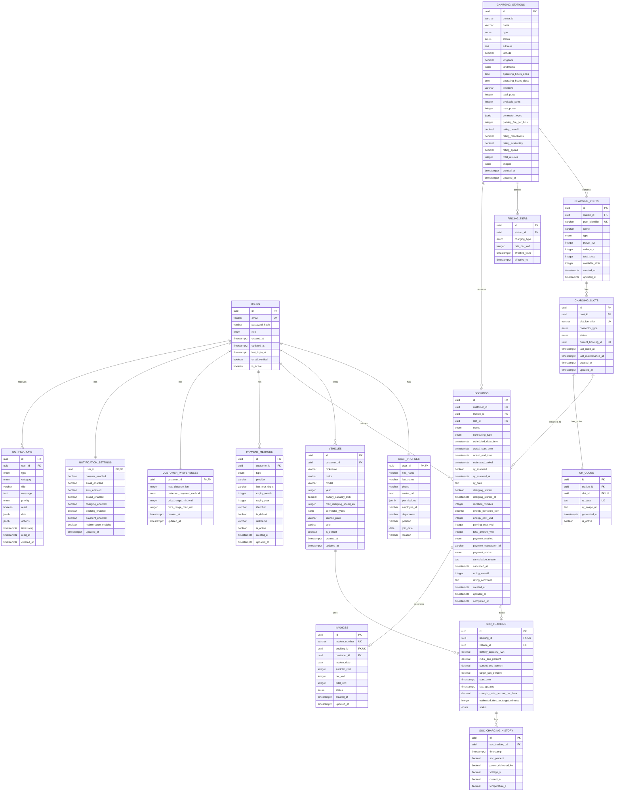

# ERD - ENTITY RELATIONSHIP DIAGRAM

## SkaEV Database - PostgreSQL 16



---

## Giải thích các mối quan hệ chính:

### 1. User & Authentication Flow

- `USERS` (1) ↔ (1) `USER_PROFILES`: One-to-One, bắt buộc
- `USERS` (1) ↔ (1) `CUSTOMER_PREFERENCES`: Optional, chỉ cho customers
- `USERS` (1) ↔ (0..n) `VEHICLES`: Customer có thể có nhiều xe

### 2. Station Hierarchy (3-Level)

```
CHARGING_STATIONS (Location)
    ├─ CHARGING_POSTS (Physical charger unit: AC/DC, power level)
    │   └─ CHARGING_SLOTS (Individual connector port: A1, B2, C3...)
    └─ PRICING_TIERS (Historical pricing by charging type)
```

### 3. Booking & Charging Flow

```
1. BOOKINGS created (status: pending)
2. QR scan → confirmed
3. Start charging → SOC_TRACKING initiated
4. Real-time updates → SOC_CHARGING_HISTORY
5. Complete → INVOICES generated
```

### 4. Payment & Billing

- `PAYMENT_METHODS`: Lưu payment instruments
- `INVOICES`: Generated sau khi booking completed
- Link: `BOOKINGS` → `INVOICES` (1:1)

### 5. Notification System

- `NOTIFICATIONS`: Real-time events
- `NOTIFICATION_SETTINGS`: User preferences per category
- Support: Browser, Email, SMS, Push

---

## Lưu ý về Cardinality:

### Mandatory Relationships (NOT NULL FK):

- `USER_PROFILES.user_id` → `USERS.id`
- `VEHICLES.customer_id` → `USERS.id`
- `CHARGING_POSTS.station_id` → `CHARGING_STATIONS.id`
- `CHARGING_SLOTS.post_id` → `CHARGING_POSTS.id`
- `BOOKINGS.customer_id` → `USERS.id`
- `BOOKINGS.station_id` → `CHARGING_STATIONS.id`

### Optional Relationships (NULL FK):

- `BOOKINGS.slot_id` → `CHARGING_SLOTS.id` (slot assigned sau khi scan QR)
- `CHARGING_SLOTS.current_booking_id` → `BOOKINGS.id` (chỉ khi slot occupied)
- `SOC_TRACKING.vehicle_id` → `VEHICLES.id` (nếu có vehicle info)

---

## Indexes Strategy Summary:

### Hot Tables (cần index đặc biệt):

1. **BOOKINGS**: Partition by created_at (monthly)
2. **SOC_CHARGING_HISTORY**: Time-series, partition by timestamp (daily)
3. **NOTIFICATIONS**: TTL policy (delete after 90 days)

### GIS Indexes:

- `CHARGING_STATIONS`: PostGIS extension cho nearby search

### JSONB Indexes:

- `connector_types`, `permissions`, `data`: GIN indexes

---

## Data Flow Visualization:

```
Customer → Select Station → Create Booking (pending)
    ↓
Arrive at Station → Scan QR Code → Booking confirmed
    ↓
Plug in vehicle → Start Charging → SOC Tracking initiated
    ↓
Real-time monitoring → SOC History logged every 3 seconds
    ↓
Target SOC reached → Stop Charging → Booking completed
    ↓
Invoice generated → Payment processed → Receipt sent
    ↓
Rating & Review → Analytics updated
```

---

## Database Size Estimates (1 Year):

| Table                | Rows/Year | Storage |
| -------------------- | --------- | ------- |
| USERS                | ~10,000   | ~5 MB   |
| BOOKINGS             | ~500,000  | ~200 MB |
| SOC_CHARGING_HISTORY | ~100M     | ~15 GB  |
| NOTIFICATIONS        | ~2M       | ~500 MB |
| CHARGING_STATIONS    | ~500      | ~2 MB   |

**Total Estimate:** ~20 GB/year (before archival)

---

## Recommended Extensions:

```sql
CREATE EXTENSION IF NOT EXISTS "uuid-ossp";      -- UUID generation
CREATE EXTENSION IF NOT EXISTS "pgcrypto";        -- Encryption
CREATE EXTENSION IF NOT EXISTS "postgis";         -- Geospatial queries
CREATE EXTENSION IF NOT EXISTS "pg_trgm";         -- Fuzzy text search
CREATE EXTENSION IF NOT EXISTS "btree_gin";       -- Multi-column GIN indexes
```
